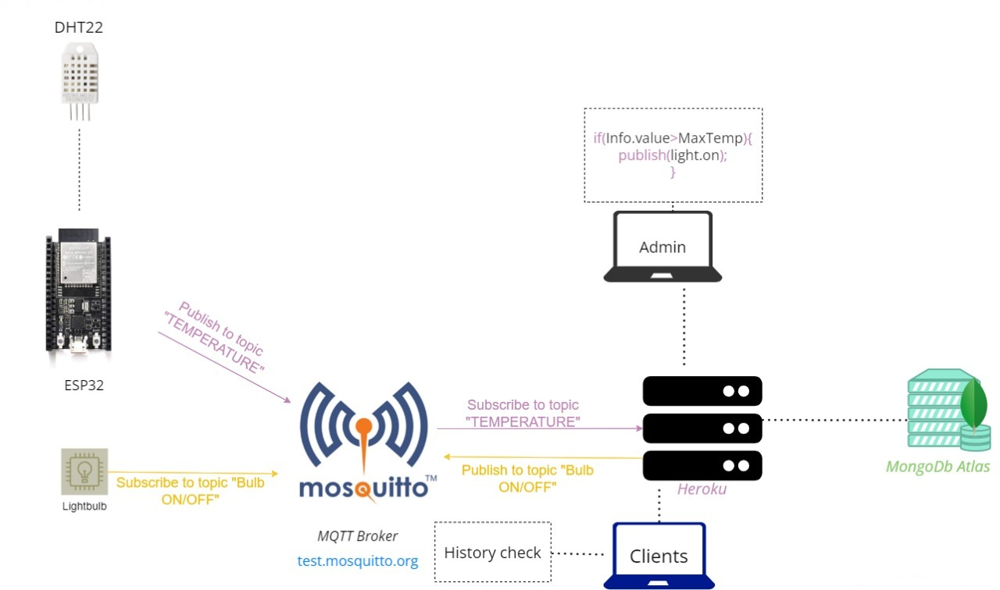
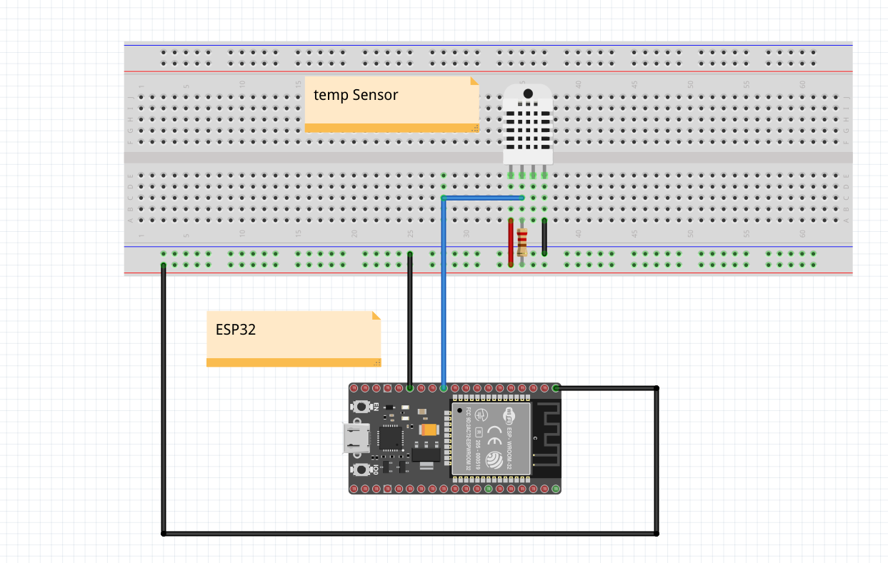
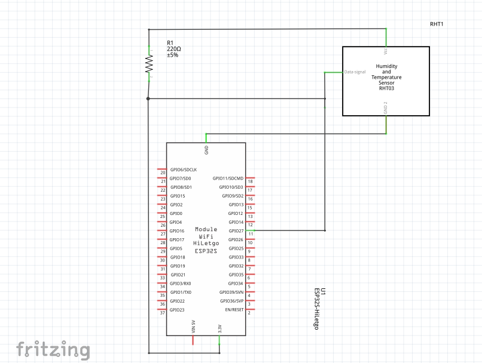
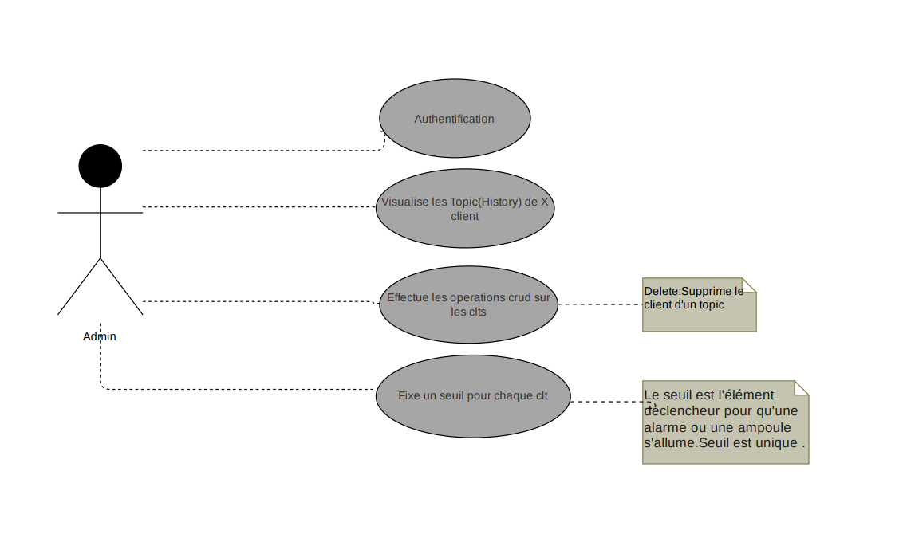
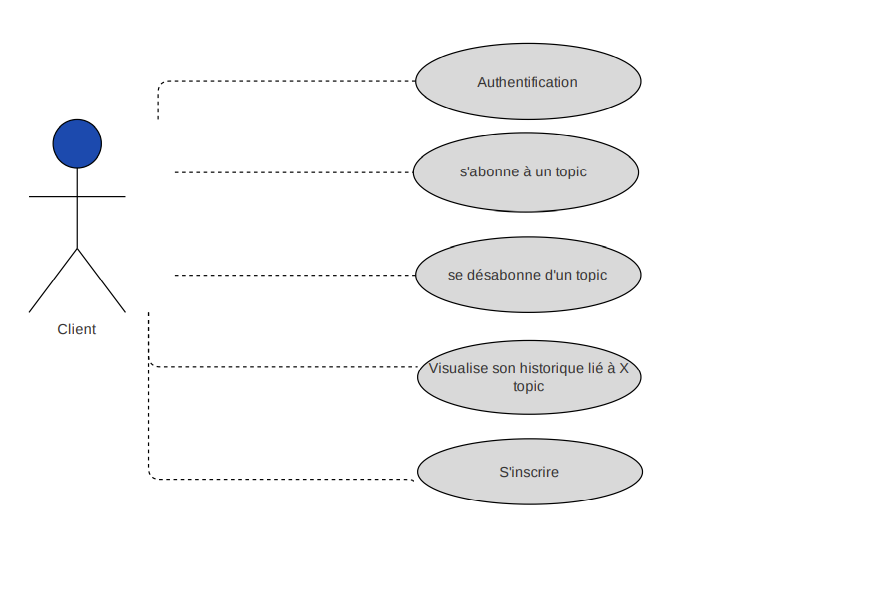

## Tutored Project
This project aims to improve healthcare by leveraging connected objects. Specifically, it provides doctors with a way to remotely monitor the health status of their patients using an ESP32 microcontroller and a heat sensor. By connecting the ESP32 to our application, doctors can set a temperature threshold, and if the patient's temperature exceeds this threshold, the ESP32 sends a signal to the application to notify the doctor. This allows doctors to keep track of their patients' health status from a distance, providing them with more flexibility and enabling them to take proactive measures if needed.


**Materials: Esp32, DHT11 or DHT22, BreadBoard, Jumper wires.

**Technologies: React (Front end), Node.js, MongoDB.

**IDE: Arduino, VS Code.

**Prototyping: Fritzing.


## 1-Business Diagram :




## 2-BreadBoard :



## 3-Schematic:



## 4-Use case diagram :




## heroku Link
```
https://e-health-esisa.herokuapp.com/
```
